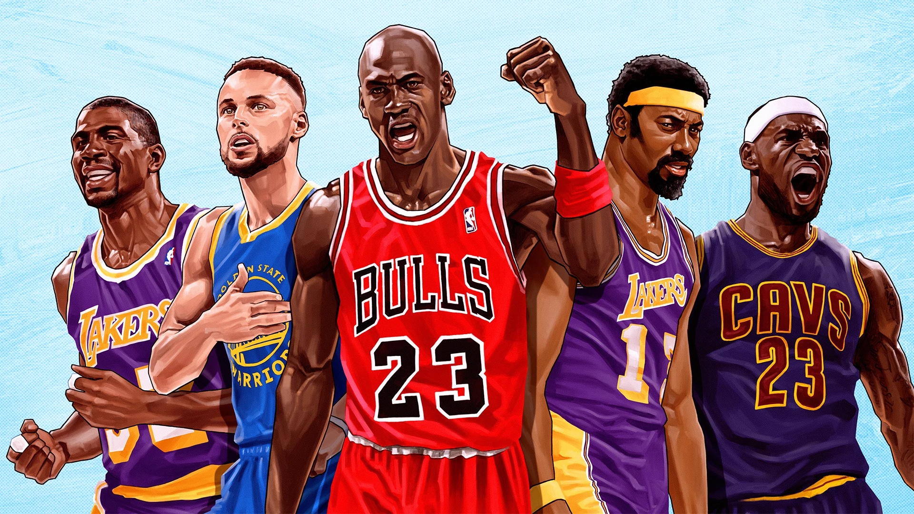
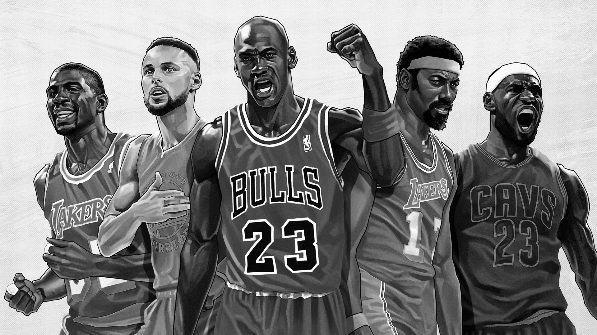
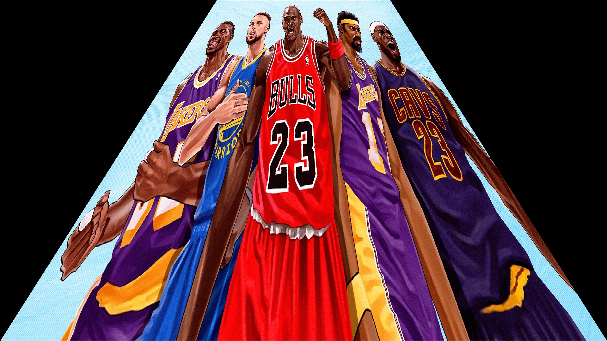

# imgmanip-

Design Using C++ Final Project  <br />
This is  the image manipulation library implemented in C++.  We have the following features: 
* GrayScale
* Convolution 
* Image Warping
* Photo Mosaic<br />

Goal : <br />
We aim to provide a library package that can treat images with some amazing effects. The GrayScale and Convolution is the basic operation for the image manipulation and widely used. The image warping can be used to make some pictures fit in different shapes. For example, if the company wants to add the advertisement on some irregular surfaces, image warping can help the company to make the logo better fit in that surfaces in the picture. The photo mosaic can be used for business communication. For example, it can be used to document the parties or events with the company's logo as the target images and the employees and event pictures as the source images. 

## Getting Started

### Install Dependencies

Install any future dependencies into the `lib` folder. 
Current dependencies include:
- `armidillo` for linear algebra, 
- `libjpeg` and `libpng` for decoding images
- `boost GIL` for reading images

### Important

You will need to run `./install.sh` to finish setting up these dependencies. ENSURE YOU HAVE NO WHITESPACE IN YOUR DIRECTORY PATH.

### Build program

Below

1. First generate precompiled headers
   '''imgmanip/imgio/pch.h.gch'''
2. Build the main program
   '''make'''
3. Run the program
   ./main

For future tests, write additional make entry in Makefile.

### Use program
```
Usage options:
        ./main —-mosaic 'tgtImage.png' ‘srcDirectory'
        ./main ——homography 'srcImage.png' ['trapezoid' | 'spiral' | 'rTrapezoid' | 'random']
        ./main --grayscale 'srcImage.png' 
                        optional: --shades intNumber

         For custom usage, modify main function and choose from our wide range of tools

```

### imgmanip

Each subdirectory in `imgmanip` is a "module." Remember to update Makefile when you add a new "module."

### tests

Contains test executable.

## Some Demo Operations
## Mosaic
Target image:
<br></br>
<!--  -->
Mosaic image:
<!--  -->
<br></br>


## Grayscale
Target image:
<br></br>
Grayscale image:
<br></br>


## Homography
Target image:
<br></br>
Homography image:
<br></br>


## Future directions

1. Match based on other image features such as those generated via conv nets. This can work towards reducing the number of images needed to construct an accurate images
2. choosing set of regions vs
