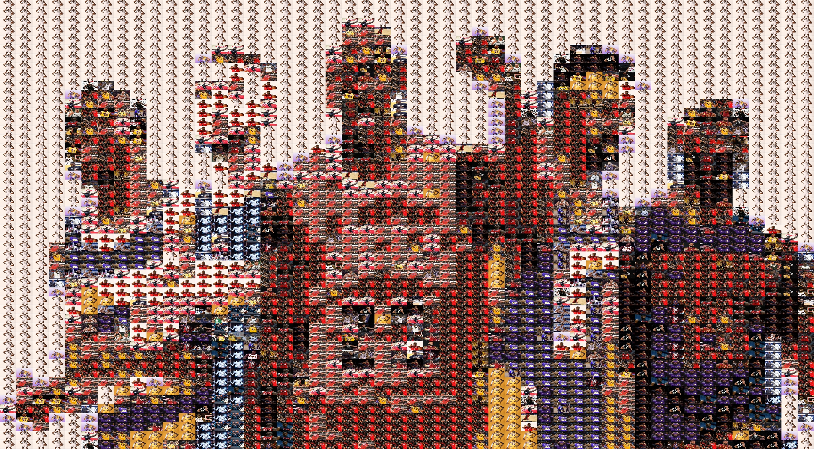

# imgmanip-

Design Using C++ Final Project

## Getting Started

### Install Dependencies

Install future dependencies into the `lib` folder. Currently, there is only `armidillo` for linear algebra.

You will need to run `./install.sh` to finish setting up these dependencies. ENSURE YOU HAVE NO WHITESPACE IN YOUR DIRECTORY PATH.

### Build program

Below

1. First generate precompiled headers
   '''imgmanip/imgio/pch.h.gch'''
2. Build the main program
   '''make'''
3. Run the program
   ./main

For future tests, write additional make entry in Makefile.

### imgmanip

Each subdirectory in `imgmanip` is a "module." Remember to update Makefile when you add a new "module."

### tests

Contains test executable.

## Demo

Target image:

Mosaic image:

## Future directions

1. Match based on other image features such as those generated via conv nets. This can work towards reducing the number of images needed to construct an accurate images
2. choosing set of regions vs
